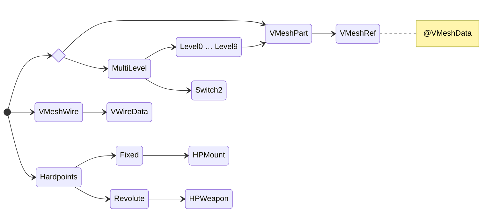

[Return to parent folder (File Structures)](../index.md)

## Overview

.3db UTF file.

## Level of detail

To display model mesh root entry should contain either `VMeshPart` or `MultiLevel` when model has more than one LOD.

Each level entry should contain `VMeshPart` (which in turn should contain `VMeshRef`) pointing to chunk in `VMeshData` to draw as LOD mesh.

`MultiLevel` may contain `Switch2` entry as array of float numbers starting with 0 and each subsequent number a maximum range for a level.

## HUD wireframe

When object using the model can be targeted a wireframe model can be displayed in contact list of HUD.

Root entry should contain `VMeshWire` entry with `VWireData` data entry inside.

* Typically `VWireData` will use one of the mesh buffers already used by part LOD but it may point to any other to draw shapes not bound to vertices in displayed mesh.