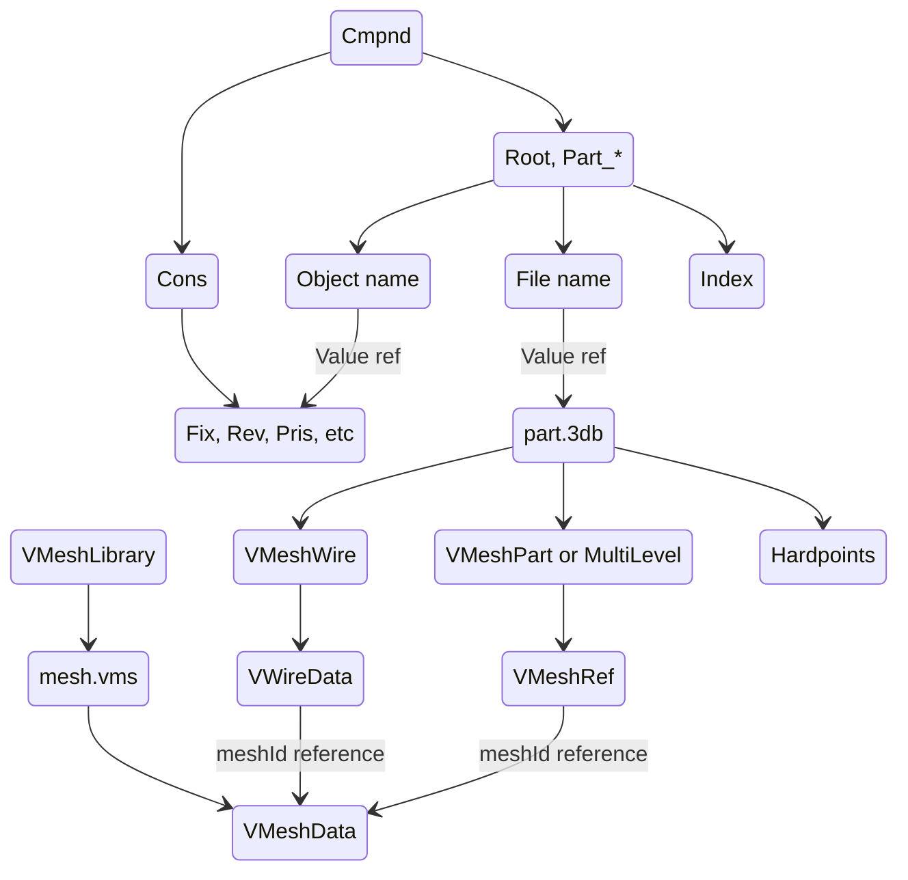

# .cmp (Compound model)

Compound comprised for multiple parts. Ships with destructible parts, stations with docking ports having moving doors and so forth.

Compound model embeds one or more .3db inside while using shared resources (meshes, materials, etc) between parts.

`Cmpnd` entry contains `Root` part and other parts starting with `Part_` prefix. Hierarchial relation between parts is defined in constraints `Cons` entry.

## Constraints

* Parent and child part names in constraints are always 64 bytes regardless of actual string length, string is trimmed at NUL character.

### Fix (fixed)

| Name        | Type     | Description          |
| ----------- | -------- | -------------------- |
| parent      | char[64] | Parent name.         |
| child       | char[64] | Child name.          |
| translation | float[3] | Translation vector.  |
| rotation    | float[9] | 3x3 rotation matrix. |

* Inanimate but can be made destructible via [CollisionGroup] section in archetype.

### Rev (revolute)

| Name        | Type     | Description            |
| ----------- | -------- | ---------------------- |
| parent      | char[64] | Parent name.           |
| child       | char[64] | Child name.            |
| translation | float[3] | Translation vector.    |
| offset      | float[3] | Offset vector.         |
| rotation    | float[9] | 3x3 rotation matrix.   |
| axis        | float[3] | Direction axis vector. |
| min         | float    | Min angle.             |
| max         | float    | Max angle.             |

* Animated by keyframe with single float value.

### Pris (prismatic)

| Name        | Type     | Description            |
| ----------- | -------- | ---------------------- |
| parent      | char[64] | Parent name.           |
| child       | char[64] | Child name.            |
| translation | float[3] | Translation vector.    |
| offset      | float[3] | Offset vector. Unused. |
| rotation    | float[9] | 3x3 rotation matrix.   |
| axis        | float[3] | Direction axis vector. |
| min         | float    | Min length.            |
| max         | float    | Max length.            |

* Animated by keyframe with single float value.

### Cyl (cylindric)

| Name        | Type     | Description          |
| ----------- | -------- | -------------------- |
| parent      | char[64] | Parent name.         |
| child       | char[64] | Child name.          |
| translation | float[3] | Translation vector.  |
| offset      | float[3] | Offset vector.       |
| rotation    | float[9] | 3x3 rotation matrix. |
| axis        | float[3] | Direction axis.      |
| rotateMin   | float    |                      |
| rotateMax   | float    |                      |
| slideMin    | float    |                      |
| slideMax    | float    |                      |

* ❗ Exists but appears to be unused. Attempting to animate cylindrical joint crashes the game.

### Sphere (spherical)

Ball joint and unlike revolute constraint its rotation isn't axis fixed.

| Name        | Type     | Description          |
| ----------- | -------- | -------------------- |
| parent      | char[64] | Parent name.         |
| child       | char[64] | Child name.          |
| translation | float[3] | Translation vector.  |
| rotation    | float[9] | 3x3 rotation matrix. |
| pitchMin    | float    |                      |
| pitchMax    | float    |                      |
| yawMin      | float    |                      |
| yawMax      | float    |                      |
| rollMin     | float    |                      |
| rollMax     | float    |                      |

* Animated by keyframe with quaternion value.

### Loose

Permits free motion (translation and rotation).

| Name        | Type     | Description          |
| ----------- | -------- | -------------------- |
| parent      | char[64] | Parent name.         |
| child       | char[64] | Child name.          |
| translation | float[3] | Translation vector.  |
| rotation    | float[9] | 3x3 rotation matrix. |

* Animated by keyframe with vector and quaternion values.