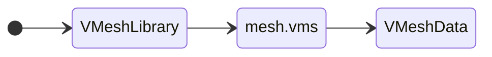
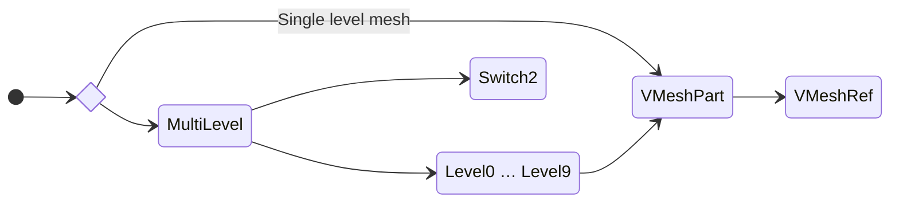
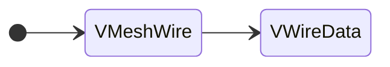

[Return to parent folder (File Structures)](../index.md)

## Overview

Meshes are usually embedded into rigid model files (.3db and .cmp) with exception of UI where mesh data is stored in separate .vms file.

## VMeshData

VMeshData is pretty much a big vertex/index buffer that contains all vertices and triangles of one or multiple parts. However when containing meshes of multiple parts VMeshData isn’t directly aware of how many has, it’s a dumb storage, but an indirect indication that another part begins within its data set is when VMeshGroup.vertexStart is 0 and when vertex index in triangle also starts from 0. Normally parts never share vertices, but mesh groups within a part may.

| Name          | Type      | Description                            |
| ------------- | --------- | -------------------------------------- |
| meshType      | uint32    | Always 1. Game crashes otherwise.      |
| primitiveType | uint32    | Direct3D primitive type.               |
| groupCount    | uint16    | Mesh group count.                      |
| indexCount    | uint16    | Element buffer count.                  |
| vertexFormat  | uint16    | Direct3D FVF (Flexible Vertex Format). |
| vertexCount   | uint16    | Vertex buffer count.                   |
| *groups*      | *varying* | Mesh groups.                           |
| *indices*     | *varying* | Element indices.                       |
| *vertices*    | *varying* | Vertex attribute data.                 |

* Element indices are uint16.
* Vertex attribute length depends on FVF mode.
* VMeshData can be mapped to OpenGL VAO (Vertex Array Object)

Primitive types are:

| Value | Type           |
| ----- | -------------- |
| 1     | Point list     |
| 2     | Line list      |
| 3     | Line strip     |
| 4     | Triangle list  |
| 5     | Triangle strip |
| 6     | Triangle fan   |

These are vertex format flags and modes which Freelancer uses:

| Name           | Mask value | Description | Vertex value |
| -------------- | ---------- | ----------- | ------------ |
| D3DFVF_XYZ     | 0x0001     | Position    | float[3]     |
| D3DFVF_NORMAL  | 0x0010     | Normal      | float[3]     |
| D3DFVF_DIFFUSE | 0x0040     | Color       | uint32       |
| D3DFVF_TEXn    | 0xFF00     | UV1-8       | float[2]     |

* D3DFVF_XYZ, D3DFVF_NORMAL, D3DFVF_DIFFUSE and D3DFVF_TEX0 to D3DFVF_TEX8 supported.
* D3DFVF_PSIZE and D3DFVF_SPECULAR are not supported and will result in corrupted drawing.

A mesh group is a collection of vertices and vertex indices forming triangles that are grouped by a single material identifier. It is fairly common in Freelancer for a model or even an individual part of a compound model to use multiple materials. So a model or each of its parts may use one more groups if they use multiple materials.

| Name        | Type   | Description                             |
| ----------- | ------ | --------------------------------------- |
| materialId  | uint32 | Material ID (FLCRC32 of material name). |
| vertexStart | uint16 | Vertex buffer start index.              |
| vertexEnd   | uint16 | Vertex buffer end index.                |
| indexCount  | uint16 | Element buffer index count.             |
| padding     | uint16 | Padding. Should be 0xCC.                |

## VMeshRef

Pointer to chunk of data in VMeshData.

| Name        | Type     | Description                                       |
| ----------- | -------- | ------------------------------------------------- |
| size        | uint32   | VMeshRef byte size, always 60.                    |
| meshId      | uint32   | Mesh ID (FLCRC32 of VMeshData parent entry name). |
| vertexStart | uint16   | Vertex buffer start index.                        |
| vertexCount | uint16   | Vertex buffer index count.                        |
| indexStart  | uint16   | Element buffer start index.                       |
| indexCount  | uint16   | Element buffer index count.                       |
| groupStart  | uint16   | Mesh group start index.                           |
| groupCount  | uint16   | Mesh group count.                                 |
| extents     | float[6] | Bounding box as max and min of x, y and z.        |
| center      | float[3] | Bounding sphere center.                           |
| radius      | float    | Bounding sphere radius.                           |

## VWireData

Uses mesh vertices to construct lines for HUD wireframe view.

| Name        | Type      | Description                                                  |
| ----------- | --------- | ------------------------------------------------------------ |
| size        | uint32    | VWireData header size, always 16.                            |
| meshId      | uint32    | Mesh ID.                                                     |
| vertexStart | uint16    | Vertex buffer start index.                                   |
| vertexCount | uint16    | Unique vertex count.                                         |
| indexCount  | uint16    | Element buffer index count.                                  |
| vertexRange | uint16    | Range between maximum vertex index and minimum vertex index. |
| *indices*   | *varying* | A pair of element indices per line drawn.                    |

* Like element indices in mesh these are uint16.
* There's a limit to how many indices a drawn wireframe model (including any attachments) can have.
