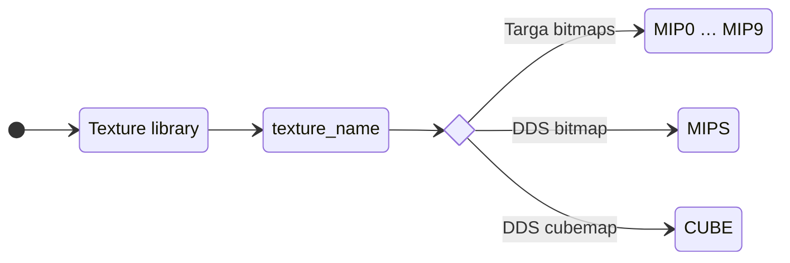
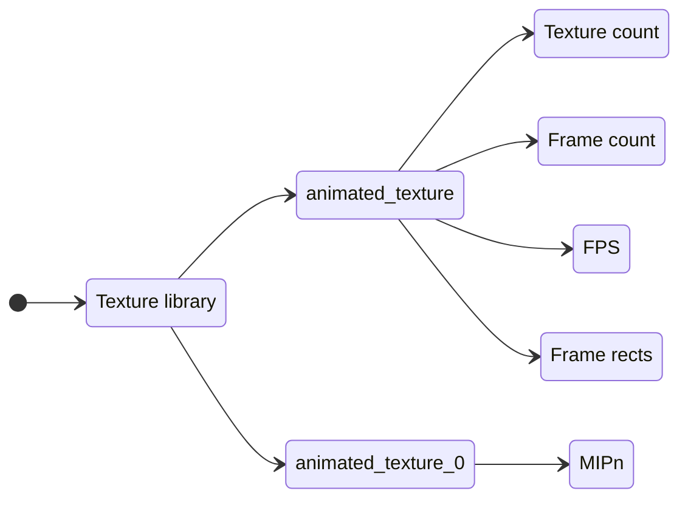

## Overview

Textures are either stored in separate file (.txm) or embedded into model files (.3db, .cmp, .dfm, etc).

Freelancer supports these types:

* Uncompressed Targa (.tga) images in 16-bit (5551, RGB) mode, 24-bit mode (888, RGB) and 32-bit mode (8888, RGBA). ❗ RLE compressed Targa and/or palette maps are unsupported.
* DirectDrawSurface (.dds) images in uncompressed or DXT compressed modes. Cubemaps are supported for environment mapping.

Targa images are individually stored as MIPn entries starting with 0 being full size and each subsequent entry half the size of previous mipmap.
DirectDrawSurface image will embed mipmaps (if it has any) and will go into MIPS entry.

# Texture animation

Freelancer has frame-based (flipbook) animation for textures.

| Name          | Type      | Description                             |
| ------------- | --------- | --------------------------------------- |
| Texture count | int32     | Textures used in animation. (1 or more) |
| Frame count   | int32     | Total frame count.                      |
| FPS           | float     | Animation frame rate.                   |
| Frame rects   | *varying* | Animation frames.                       |

* Individual textures then must use suffix _n where n is texture index starting with 0. For example texture with name `lightning256` will contain entries above and another texture `lightning256_0` will contain actual MIPn/MIPS entries storing bitmaps.

Each animation frame:

| Name   | Type  | Description                            |
| ------ | ----- | -------------------------------------- |
| index  | int32 | Texture image index (starting with 0). |
| startU | float | Start point U coordinate.              |
| startV | float | Start point V coordinate.              |
| endU   | float | End point U coordinate.                |
| endV   | float | End point V coordinate.                |

* Coordinates origin at top left corner.
