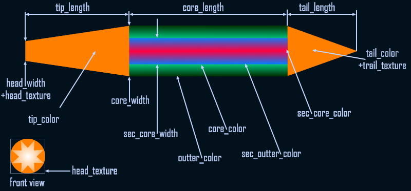

:::caution

This page is a work in progress!

There may be missing, incomplete or incorrect information on this page as it's still being built! Take information here with a pinch of salt, and feel free to contribute and correct things!

:::

## Overview

These files govern effects and the sounds attached to them, their types, as well as the texture and ale components of effects. `[BeamSpear` and `[BeamBolt]` blocks can also be used to directly create simple beam effects.

### Vanilla Examples

* `DATA\FX\WEAPONS\weapons_ale.ini`
* `DATA\FX\beam_effects.ini`
* `DATA\FX\effects.ini`
* `DATA\FX\effect_types.ini`

## Syntax

`[EffectType]` blocks should always be called before everything else, followed by `[VisEffect]`. These are usually called in a seperate ini file as defined in [freelancer.ini](../hardcoded-inis/exe/freelancer.ini.md).

### EffectType

:::caution

The number and names of `[EffectType]` blocks are actually hard coded, and cannot be changed or added. The `[EffectType]` block does however, allow you to define the properties of each type.

:::

```ini
[EffectType]
nickname = STRING
priority = INT
generic_priority = INT
lod_type = STRING
radius = INT
visibility = STRING
update = STRING
run_time = INT
pbubble = INT, INT
```

| Parameter        | Information |
| ---------------- | ----------- |
| nickname         |             |
| priority         |             |
| generic_priority |             |
| lod_type         |             |
| radius           |             |
| visibility       |             |
| update           |             |
| run_time         |             |
| pbubble          |             |

### VisEffect

```ini
[VisEffect]
nickname = STRING
alchemy = PATH
effect_crc = INT
textures = PATH
```

| Parameter  | Information                                                                                    |
| ---------- | ---------------------------------------------------------------------------------------------- |
| nickname   | How this effect is referred to by `[Effect]` blocks.                                           |
| alchemy    | The path to the .ale file                                                                      |
| effect_crc | The CRC reference pointing to the effect name used inside the .ale file.                       |
| textures   | References the specific txm files used by the effect. Multiple `textures` keys can be defined. |

### EffectLOD

```ini
[EffectLOD]
type = STRING
max_lod_screen_size = INT
min_lod_screen_size = INT
min_screen_size = INT
```

| Parameter           | Information |
| ------------------- | ----------- |
| type                |             |
| max_lod_screen_size |             |
| min_lod_screen_size |             |
| min_screen_size     |             |

### Effect

```ini
[Effect]
nickname = STRING
effect_type = STRING
snd_effect = STRING ;optional
vis_effect = STRING 
vis_generic = STRING ;optional
lgt_effect = STRING ;optional
lgt_range_scale = INT ;optional
lgt_radius = INT ;optional
```

| Parameter       | Information                                                                                                                                |
| --------------- | ------------------------------------------------------------------------------------------------------------------------------------------ |
| nickname        | How this effect is referred to by other blocks and files.                                                                                  |
| effect_type     | The effect type as defined in the `[EffectType]` block.                                                                                    |
| snd_effect      | The sound effect attached to this effect as it is played as defined in [sounds](sounds.md). This will loop for the duration of the effect. |
| vis_effect      | The `[VisEffect]` block to use with this effect.                                                                                           |
| vis_generic     | Uncertain. This may be a 'fallback effect' used when an effect cannot be played for some reason or another.                                |
| lgt_effect      |                                                                                                                                            |
| lgt_range_scale |                                                                                                                                            |
| lgt_radius      |                                                                                                                                            |

```ini
[BeamSpear]
nickname = STRING
tip_length = INT
tail_length = INT
head_width = INT
core_width = FLOAT
tip_color = INT, INT, INT
core_color = INT, INT, INT
outter_color = INT, INT, INT
tail_color = INT, INT, INT
head_brightness = INT
trail_brightness = FLOAT
head_texture = STRING
trail_texture = STRING
flash_size = INT
```

| Parameter        | Information                                                   |
| ---------------- | ------------------------------------------------------------- |
| nickname         | How the BeamSpear is referred to in `[Effect]` blocks.        |
| tip_length       | Length of the tip element of the beam                         |
| tail_length      | Length of the tail element of the beam                        |
| head_width       | Width of the head element of the beam                         |
| core_width       | Width of the core element of the beam                         |
| tip_color        | RGB color of the tip element of the beam                      |
| core_color       | RGB color of the core element of the beam                     |
| outter_color     | RBG color of the outer 'glow' of the beam                     |
| tail_color       | RGB color of the tail element of the beam                     |
| head_brightness  | Alpha of the head element of the beam (0-1 range)             |
| trail_brightness | Alpha of the trail element of the beam (0-1 range)            |
| head_texture     | Texture of the head element of the beam (Can be ball or star) |
| trail_texture    | Texture of the trail element of the beam (Be be wide or thin) |
| flash_size       | Flash size of the beam when it is created.                    |

```ini

[BeamBolt]
nickname = STRING
tip_length = INT
tail_length = INT
core_length = INT
head_width = INT
core_width = FLOAT
sec_core_width = INT
tip_color = INT, INT, INT
core_color = INT, INT, INT
outter_color = INT, INT, INT
sec_core_color = INT, INT, INT
sec_outter_color = INT, INT, INT
tail_color = INT, INT, INT
head_brightness = INT
trail_brightness = FLOAT
head_texture = STRING
trail_texture = STRING
flash_size = INT
```

| Parameter        | Information                                                   |
| ---------------- | ------------------------------------------------------------- |
| nickname         | How the BeamSpear is referred to in `[Effect]` blocks.        |
| tip_length       | Length of the tip element of the beam                         |
| tail_length      | Length of the tail element of the beam                        |
| head_width       | Width of the head element of the beam                         |
| core_width       | Width of the core element of the beam                         |
| sec_core_width   |                                                               |
| tip_color        | RGB color of the tip element of the beam                      |
| core_color       | RGB color of the core element of the beam                     |
| outter_color     | RBG color of the outer 'glow' of the beam                     |
| sec_core_color   |                                                               |
| sec_outter_color |                                                               |
| tail_color       | RGB color of the tail element of the beam                     |
| head_brightness  | Alpha of the head element of the beam (0-1 range)             |
| trail_brightness | Alpha of the trail element of the beam (0-1 range)            |
| head_texture     | Texture of the head element of the beam (Can be ball or star) |
| trail_texture    | Texture of the trail element of the beam (Be be wide or thin) |
| flash_size       | Flash size of the beam when it is created.                    |

#### Beam Breakdown

A breakdown of different elements that make up BeamSpear and BeamBolt entries can be found below. Credit goes to Cpt_Rei_Fukai.

